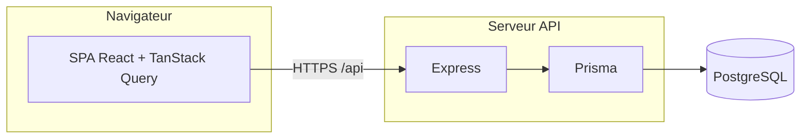
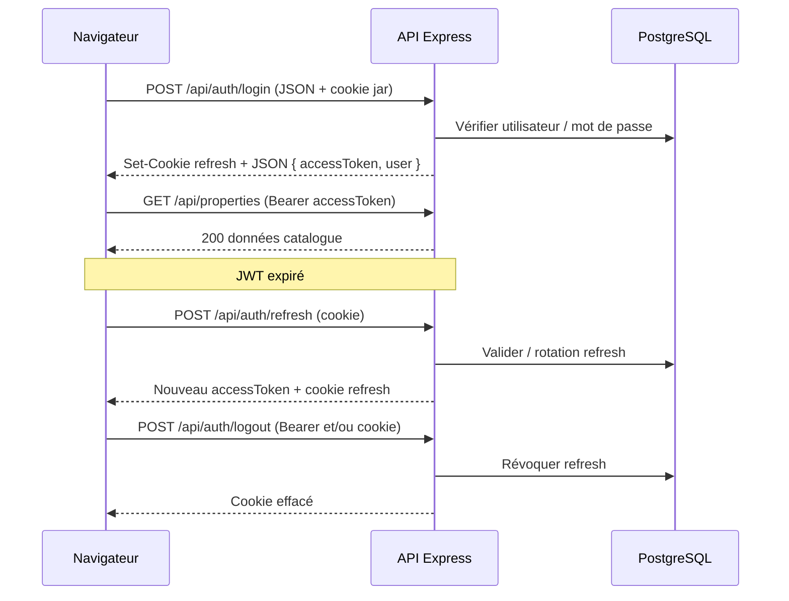
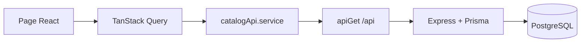

# EL-YANIS — Documentation technique du projet

Application web immobilière (Algérie occidentale) : vitrine publique, catalogue d’annonces, formulaires de contact / demandes, API REST avec PostgreSQL, espace administrateur sécurisé.

---

## Table des matières

1. [Vue d’ensemble de l’architecture](#1-vue-densemble-de-larchitecture)
2. [Stack technique](#2-stack-technique)
3. [Structure du dépôt](#3-structure-du-dépôt)
4. [Frontend](#4-frontend)
5. [Backend](#5-backend)
6. [Routes API](#6-routes-api)
7. [Authentification](#7-authentification)
8. [Système administrateur](#8-système-administrateur)
9. [Flux de données](#9-flux-de-données)
10. [Base de données](#10-base-de-données)
11. [Configuration et environnement](#11-configuration-et-environnement)
12. [Observabilité](#12-observabilité)
13. [Commandes utiles](#13-commandes-utiles)

---

## 1. Vue d’ensemble de l’architecture

Le système est découpé en **trois couches principales** :

| Couche | Rôle |
|--------|------|
| **SPA React** | Interface utilisateur, routage client, React Query pour les données, contextes i18n / thème / auth. |
| **API Express** | REST JSON, validation, authentification JWT, rôles, persistance via Prisma. |
| **PostgreSQL** | Données métier (utilisateurs, biens, agents, services page, demandes). |

En développement, Vite (port **8080**) peut **proxy** les requêtes `/api` vers l’API locale (**3001** par défaut). En production, le frontend et l’API peuvent être sur le même domaine (chemins relatifs `/api/...`) ou sur des origines distinctes (`VITE_API_URL`, `FRONTEND_ORIGIN` pour CORS).



---

## 2. Stack technique

| Domaine | Technologies |
|---------|----------------|
| UI | React 19, TypeScript, Vite 7, Tailwind CSS 4, shadcn/ui (Radix), react-router-dom 7 |
| Données async | TanStack React Query 5 |
| Formulaires | react-hook-form, Zod |
| API | Node.js 20+, Express 4, Prisma 5, PostgreSQL |
| Auth | JWT (accès), cookie httpOnly (rafraîchissement), bcrypt |
| Optionnel | Cloudflare Turnstile (formulaires / auth), stockage S3-compatible (images admin) |

---

## 3. Structure du dépôt

| Chemin | Description |
|--------|-------------|
| `src/` | Application React (pages, composants, hooks, `lib/api`, auth) |
| `backend/src/` | Point d’entrée API, `app.ts`, routes, contrôleurs, services, middleware |
| `backend/prisma/` | Schéma Prisma, migrations, seed |
| `public/` | Assets statiques copiés dans `dist/` |
| `docker/` | Configuration Nginx pour image Docker statique |
| `.env.example` | Variables d’environnement documentées |

---

## 4. Frontend

### 4.1 Point d’entrée

- `index.html` → `src/main.tsx` : initialisation optionnelle **Sentry** (`initSentry`), montage React en mode strict.
- `src/App.tsx` : `QueryClientProvider`, `LanguageProvider`, `ThemeProvider`, `BrowserRouter` (basename `import.meta.env.BASE_URL`), `AuthProvider`, routes.

### 4.2 Routes React

| Chemin | Composant | Garde |
|--------|-----------|--------|
| `/` | Accueil | — |
| `/listings` | Catalogue | — |
| `/property/:id` | Détail bien | — |
| `/services`, `/agents`, `/about`, `/contact` | Pages vitrine | — |
| `/register` | Inscription | — |
| `/admin/login` | Connexion admin | — |
| `/admin` | Tableau de bord admin (`AdminShell`) | `RequireAdmin` |
| `/admin/users` | Gestion des utilisateurs | `RequireAdmin` |
| `*` | 404 | Sous `WebLayout` |

Les pages publiques sont enveloppées dans **`WebLayout`** (barre de navigation, pied de page). Les routes `/admin/*` sont protégées par **`RequireAdmin`** : session chargée, **`user.role === "admin"`** ; sinon redirection vers `/admin/login`.

### 4.3 Client HTTP et domaine

- URLs relatives **`/api/...`** ou base **`VITE_API_URL`** (`src/lib/api/client.ts`).
- Jeton d’accès JWT stocké **en mémoire** uniquement (`src/lib/auth/accessToken.ts`), pas dans `localStorage`.
- Les appels authentifiés utilisent l’en-tête **`Authorization: Bearer <accessToken>`** et **`credentials: "include"`** pour les cookies de rafraîchissement sur les routes auth.

### 4.4 Constantes d’API

Les chemins sont centralisés dans **`src/lib/api/endpoints.ts`** (propriétés, agents, services, contact, inquiries, routes admin).

---

## 5. Backend

### 5.1 Application Express

Fichier **`backend/src/app.ts`** (ordre illustratif) :

1. `trust proxy`
2. En-têtes de sécurité
3. **CORS** (`FRONTEND_ORIGIN`, `credentials: true`)
4. JSON (limite 2 Mo), **cookie-parser**
5. **pino-http** (logs structurés des requêtes)
6. Routes : `/health`, `/api/auth`, `/api/properties`, `/api/agents`, `/api/services`, `/api` (contact & inquiries), `/api/admin`, `/api/user`
7. Gestionnaire 404 puis **`errorHandler`** (HTTP normalisé, logs, **Sentry** sur erreurs 500)

### 5.2 Middleware d’authentification

- **`authenticate`** : lit `Authorization: Bearer`, vérifie le JWT, remplit `req.authUser`.
- **`requireRoles(...roles)`** : après `authenticate`, vérifie que `req.authUser.role` est dans la liste (ex. `"admin"`).

---

## 6. Routes API

Préfixe API : **`/api`**. Les corps sont en JSON sauf indication contraire.

### 6.1 Santé

| Méthode | Chemin | Auth | Description |
|---------|--------|------|-------------|
| GET | `/health` | Non | Statut `{ ok: true }` |

### 6.2 Authentification — `/api/auth`

| Méthode | Chemin | Auth | Description |
|---------|--------|------|-------------|
| POST | `/register` | Non | Inscription ; rate limit ; Turnstile si configuré |
| POST | `/login` | Non | Connexion ; rate limit ; cookie refresh + corps avec `accessToken` |
| POST | `/logout` | Optionnel | Révoque les refresh tokens ; efface le cookie |
| POST | `/refresh` | Cookie refresh | Nouveau JWT + rotation du refresh |
| GET | `/me` | Bearer | Profil utilisateur aligné sur le JWT |

### 6.3 Utilisateur connecté — `/api/user`

| Méthode | Chemin | Auth | Description |
|---------|--------|------|-------------|
| GET | `/profile` | Bearer | Profil (utilisateur authentifié) |

### 6.4 Biens — `/api/properties`

| Méthode | Chemin | Auth | Description |
|---------|--------|------|-------------|
| GET | `/` | Non | Liste / recherche (query selon contrôleur) |
| GET | `/featured` | Non | Biens mis en avant |
| GET | `/:id` | Non | Détail par identifiant |
| POST | `/` | Bearer **admin** | Création |
| PATCH | `/:id` | Bearer **admin** | Mise à jour |
| DELETE | `/:id` | Bearer **admin** | Suppression |

### 6.5 Agents — `/api/agents`

| Méthode | Chemin | Auth | Description |
|---------|--------|------|-------------|
| GET | `/` | Non | Liste |
| GET | `/:id` | Non | Détail |
| POST | `/` | Bearer **admin** | Création |
| PATCH | `/:id` | Bearer **admin** | Mise à jour |
| DELETE | `/:id` | Bearer **admin** | Suppression |

### 6.6 Services (page « Services ») — `/api/services`

| Méthode | Chemin | Auth | Description |
|---------|--------|------|-------------|
| GET | `/` | Non | Liste des entrées `SiteService` |
| GET | `/:id` | Non | Détail |
| POST | `/` | Bearer **admin** | Création |
| PATCH | `/:id` | Bearer **admin** | Mise à jour |
| DELETE | `/:id` | Bearer **admin** | Suppression |

### 6.7 Formulaires publics — montés sous `/api`

| Méthode | Chemin | Auth | Description |
|---------|--------|------|-------------|
| POST | `/contact` | Non | Soumission contact ; rate limit ; Turnstile si requis |
| POST | `/inquiries` | Non | Demande liée à un bien ; rate limit ; Turnstile si requis |

### 6.8 Administration — `/api/admin`

Toutes les routes exigent **`authenticate` + rôle `admin`** (voir `requireAdminMiddleware`).

| Méthode | Chemin | Description |
|---------|--------|-------------|
| GET | `/users` | Liste des comptes (sans hash mot de passe) |
| PATCH | `/users/:id` | Corps `{ "role": "admin" \| "user" }` |
| DELETE | `/users/:id` | Suppression compte (règles métier : dernier admin, auto-suppression, etc.) |
| POST | `/uploads/presign` | URL PUT présignée pour upload d’image (corps `contentType`) |
| GET | `/dashboard` | Statistiques agrégées (compteurs) |
| GET | `/inquiries` | Liste des demandes (contact + biens) pour modération |
| DELETE | `/contact-submissions/:id` | Suppression d’une soumission contact |
| DELETE | `/property-inquiries/:id` | Suppression d’une demande sur bien |

---

## 7. Authentification

### 7.1 Principes

- **JWT** : court terme, transporté en **`Authorization: Bearer`** (claims : identifiant utilisateur, email, **rôle**). Le client ne peut pas modifier le rôle : il est signé côté serveur.
- **Refresh token** : stocké en base (hash), exposé au navigateur via **cookie httpOnly** (`secure` en production, `SameSite=Lax`). Sert à obtenir un nouveau JWT sans redemander le mot de passe.
- **Inscription** : le **rôle** est déterminé **uniquement côté serveur** (premier utilisateur → `admin`, ou email égal à `BOOTSTRAP_ADMIN_EMAIL`, sinon `user`). Aucun champ `role` dans le corps client n’est pris en compte pour escalader les droits.

### 7.2 Séquence type (connexion puis appel API)



### 7.3 Frontend (`AuthProvider`)

- Au chargement : si un JWT existe en mémoire, appel **`/api/auth/me`** ; sinon tentative **`/api/auth/refresh`** (cookie).
- Rafraîchissement planifié du JWT avant expiration (basé sur la date d’expiration du jeton).

---

## 8. Système administrateur

### 8.1 Côté interface

- Accès **`/admin`** et **`/admin/users`** réservés aux utilisateurs dont le contexte auth indique **`role === "admin"`**.
- Sinon redirection vers **`/admin/login`**.
- Les actions sensibles (CRUD catalogue, utilisateurs, présign upload) passent par l’**API** ; le rôle est **revérifié** sur chaque requête.

### 8.2 Côté API

- Routes sous **`/api/admin`** : middleware **`requireRoles("admin")`** (via `requireAdminMiddleware`).
- CRUD biens / agents / services « page » peut aussi passer par **`/api/properties`** (etc.) avec **`requireRoles("admin")`** selon les fichiers de routes.

### 8.3 Gestion des utilisateurs (`/api/admin/users`)

Règles visant à limiter la **suppression du dernier administrateur** et les **abus de rétrogradation** :

- Impossible de retirer le rôle admin au **dernier** compte admin.
- Impossible de se rétrograder soi-même en **user** s’il n’existe **pas** un autre admin.
- Impossible de **supprimer son propre** compte via cette route.
- Impossible de supprimer le **dernier** admin.
- Après changement de rôle ou suppression : **révocation des refresh tokens** de l’utilisateur cible pour limiter les sessions résiduelles.

### 8.4 Tableau de bord

- **`GET /api/admin/dashboard`** : agrégats (utilisateurs, admins, biens, soumissions contact, demandes biens).
- L’UI admin (`AdminShell`) consolide aussi des statistiques à partir des données chargées (catalogue, demandes).

---

## 9. Flux de données

### 9.1 Lecture publique (catalogue)



Les hooks (`useProperties`, `useFeaturedProperties`, etc.) utilisent une **clé de requête** et un **fetcher** qui appelle les services sous `src/lib/api/services/`. Les DTO sont mappés vers les types domaine **`src/lib/domain/types.ts`**.

### 9.2 Formulaires (contact, demande sur bien)

Le client envoie **POST** vers `/api/contact` ou `/api/inquiries`. L’API valide, applique éventuellement **Turnstile**, persiste dans **`ContactSubmission`** ou **`PropertyInquiry`**.

### 9.3 Écritures admin

- **Bearer admin** obligatoire.
- Biens / agents / services : REST classique selon les tables de la section 6.
- Images : **POST `/api/admin/uploads/presign`** → URL vers stockage objet (S3/R2, etc.) puis mise à jour des URLs d’images sur le bien côté application.

En production, **aucune donnée fictive ni catalogue localStorage** : le catalogue et les formulaires reposent uniquement sur l’API PostgreSQL.

---

## 10. Base de données

Modèles principaux (Prisma) :

| Modèle | Rôle |
|--------|------|
| `User` | Comptes, `Role` (`admin` \| `user`), mot de passe hashé |
| `RefreshToken` | Sessions de rafraîchissement (liaison `User`, suppression en cascade) |
| `Agent` | Agents immobiliers |
| `Property` | Annonces (multilingue, médias JSON, lien `Agent`) |
| `SiteService` | Entrées de la page Services |
| `ContactSubmission` | Messages du formulaire contact |
| `PropertyInquiry` | Demandes liées à un bien |

Énumérations : types de bien (`sale` / `rent`), villes (`CityKey`), tags, etc. — voir **`backend/prisma/schema.prisma`**.

---

## 11. Configuration et environnement

- Référence détaillée : **`.env.example`** (frontend `VITE_*`, backend `DATABASE_URL`, `JWT_*`, `FRONTEND_ORIGIN`, Turnstile, stockage S3, **Sentry**, **LOG_LEVEL**, bootstrap admin, etc.).
- **`FRONTEND_ORIGIN`** : origine exacte du site pour **CORS** et configuration des cookies côté navigateur.

---

## 12. Observabilité

- **Frontend** : Sentry optionnel (`VITE_SENTRY_DSN`, échantillonnage des traces).
- **Backend** : logs **JSON Pino** (stdout), **pino-http** pour les accès, **Sentry** optionnel (`SENTRY_DSN`) pour les erreurs non gérées et la traçabilité ; erreurs HTTP métier (`HttpError`) ne sont en général pas traitées comme des incidents Sentry.

---

## 13. Commandes utiles

```bash
npm install          # Dépendances (postinstall : prisma generate)
npm run dev          # Vite seul (frontend)
npm run dev:api      # API Express (tsx watch)
npm run dev:full     # Frontend + API (concurrently)
npm run build        # Build production SPA → dist/
npm run test         # Vitest
npm run lint         # ESLint
npm run ci           # lint + test + build + typecheck backend
npm run db:migrate   # Migrations Prisma (dev)
npm run db:seed      # Seed base
```

---

## Références croisées

| Sujet | Emplacement |
|-------|-------------|
| Constantes API frontend | `src/lib/api/endpoints.ts` |
| Schéma base | `backend/prisma/schema.prisma` |
| Routes Express | `backend/src/routes/*.routes.ts` |
| Garde admin React | `src/components/admin/RequireAdmin.tsx` |
| Client HTTP | `src/lib/api/client.ts` |
| Auth JWT serveur | `backend/src/auth/jwt.ts` |

---

*Document généré pour servir de base « prête à l’emploi » ; à adapter si vous ajoutez des routes ou changez les variables d’environnement.*
